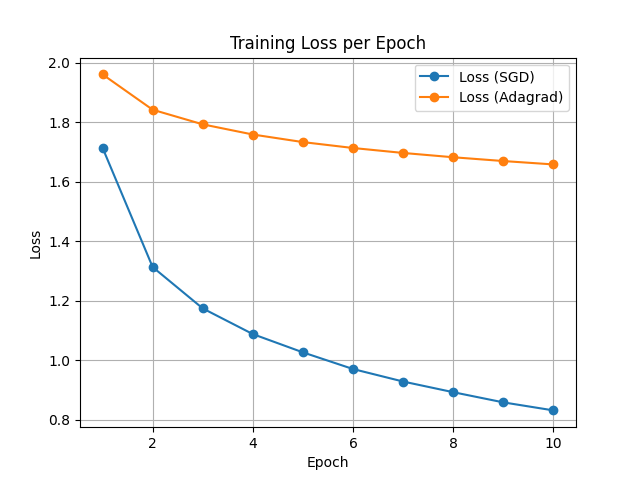

# optcv24
# Задание 2.

Подготовка окружения и обучение простого классификатора на учебном датасете, например, cifar10.

Асеев Дмитрий, SGD, Adagrad.

Главными плюсами AdaGrad является адаптивная скорость обучения и преимущество на разреженных данных (если есть признаки, которые появляются нечасто, то оптимизатор будет давать этим признакам более высокий шаг, тем самым более значительно обновляя их).
А главным минусом является невозможность "перезагрузить" шаг в отличие от RMSProp или Adam. Adagrad не включает механизм, который бы "обнулял" или сглаживал накопленное значение градиента, из-за чего модель может существенно замедлится.

Я вдохновился идеей Валерия Рябинкина по запуску функции train два раза, поэтому я создал условие выбора оптимизатора:

    if optimizer_name == 'SGD':
        optimizer = torch.optim.SGD(net.parameters(), lr=0.001, momentum=0.9)
    elif optimizer_name == 'Adam':
        optimizer = torch.optim.Adam(net.parameters(), lr=0.001)

Также в функцию добавляется логгирование потерь и считается средняя потеря за эпоху.

И дальше отрисовывается график.

И главное запустить функцию с два раза подряд:

    if __name__ == '__main__':
        sgd_losses = train(optimizer_n='SGD')
        adagrad_losses = train(optimizer_n='Adagrad')

        losses_dict = {'SGD': sgd_losses,
                   'Adagrad': adagrad_losses}
        plot_loss(losses_dict)

*ВЫВОД:* при данных условиях оптимизатор SGD показывает лучшую динамику обучения, более быстрое и более глубокое снижение функции потерь по сравнению с Adagrad.

**ПОЧЕМУ ТАК ВЫШЛО?**

Adagrad сильно адаптирует шаг обучения, и в данноом случае он, вероятно, слишком быстро становится маленьким. Это приводит к медленной сходимости по сравнению с более "агрессивным" и постоянным шагом у SGD.

# Задание 3

Вывод консоли:

    Study statistics: 
    Number of finished trials:  100
    Number of pruned trials:  78
    Number of complete trials:  22
    Best trial:
      Value:  0.5
    Params: 
        n_layers: 1
        n_units_l0: 302
        dropout_l0: 0.20513131103910964
        optimizer: RMSprop
        lr: 0.0006119827290096727

Вывод: оптимизация привела к тому, что большинство неэффективных конфигураций было отсеяно, и лучший вариант дает точность 50%. Это не очень высокий результат для CIFAR10, что указывает на необходимость либо расширения количества гиперпараметров, либо усложнения модели, либо увеличения эпох.